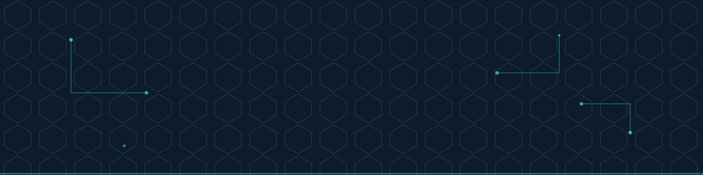

  

<h1 align="center">Hi 👋, I'm Om Bobade</h1>
<h3 align="center">Aspiring Penetration Tester | Web · Mobile · API · Network Security</h3>

Security-focused learner building hands-on proof of work across web, mobile, API, and network security — with growing exposure to Active Directory, cloud, and AI security. I document everything so my GitHub shows exactly what I can actually do.

<table align="center" border="0" cellspacing="4" cellpadding="0">
<tr>
<td></td>
<td></td>
<td></td>
<td></td>
<td></td>
<td></td>
</tr>
</table>

---

### 🛠️ Tools of the Trade
<table align="left" border="0" cellspacing="4" cellpadding="0">
<tr>
<td></td>
<td></td>
<td></td>
<td></td>
<td></td>
</tr>
<tr>
<td></td>
<td></td>
<td></td>
<td></td>
<td></td>
</tr>
</table>

 

### 📜 Certifications
<table align="left" border="0" cellspacing="4" cellpadding="0">
<tr>
<td></td>
<td></td>
<td></td>
</tr>
</table>

 

### 🔎 What I work on
- **Web Application Security** — OWASP Top 10, SQLi, XSS, SSRF, LFI/RFI, CSRF
- **API Security** — OWASP API Top 10, BOLA, broken authentication
- **Mobile Application Security** — local storage, traffic interception, app-level testing
- **Active Directory** — enumeration, privilege escalation, attack paths
- **Cloud Security** — AWS fundamentals (IAM, S3, EC2, VPC), Terraform, Prowler/CIS benchmarking
- **AI Security** — prompt injection and agentic system assessment

### 🧪 Featured Repositories
- 🌐 **[web-application-security](https://github.com/OmBobade1/notes/tree/main/01-network%20security)** — PortSwigger Academy, DVWA, bWAPP, API security
- 📱 **[mobile-thick-client-security](https://github.com/OmBobade1/mobile-thick-client-security)** — Mobile and desktop application testing
- 🏴 **[network-security-labs](https://github.com/OmBobade1/network-security-labs)** — OverTheWire Bandit + Active Directory attack write-ups
- ☁️ **[cloud-ai-security-assessments](https://github.com/OmBobade1/cloud-ai-security-assessments)** — AWS misconfiguration lab + AI prompt injection assessment
- 📓 **[C-EH-notes](https://github.com/OmBobade1/C-EH-notes)** — Structured ethical hacking study notes

---

### 📊 GitHub Stats
<table align="left" border="0" cellspacing="4" cellpadding="0">
<tr>
<td></td>
<td></td>
</tr>
</table>

 

### 📫 Reach me
- LinkedIn: www.linkedin.com/in/om-bobade
- Email: ombobade2003@gmail.com

---

<i>Actively seeking entry-level opportunities in Cybersecurity — VAPT or Security Analyst roles.</i>

